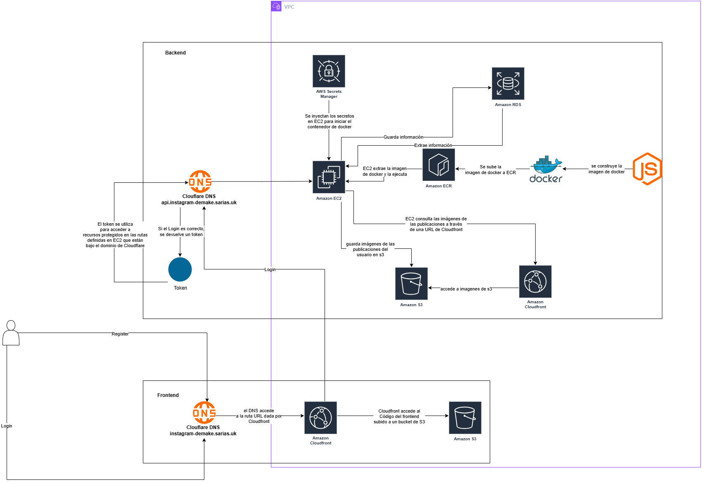

## 🚀 Demo en vivo

Visita la app en vivo

👉 [https://instagram-demake.sarias.uk](https://instagram-demake.sarias.uk)


## 🗺️ Diagrama de arquitectura en AWS
Este es el diagrama de despliegue de la página web Instagram Demake en AWS:





## 🎬 Funcionamiento de la aplicación

Mira cómo funciona la app en este video (click en la imagen):

[](https://www.youtube.com/watch?v=Wojw2Cp-O8k)


### 🧩 Endpoints

Para probar estos endpoints, puedes usar herramientas como **Postman** o **cURL**.

Recomendado: importar la colección en Postman y configurar el token si es necesario.

#### Ruta base

https://api.instagram-demake.sarias.uk


#### Health check [/api/public/health-check](https://api.instagram-demake.sarias.uk/api/public/health-check)
- Login de usuario.
- Body:
None

#### Register [/api/public/register](https://api.instagram-demake.sarias.uk/api/public/register)
- Login de usuario.
- Body:
```json
{
  "username": "usuario",
  "password": "1234"
}
``` 

#### Login [/api/public/login](https://api.instagram-demake.sarias.uk/api/public/login)
- Login de usuario.
- Body:
```json
{
  "username": "usuario",
  "name": "nombre de usuario",
  "password": "1234"
}
``` 